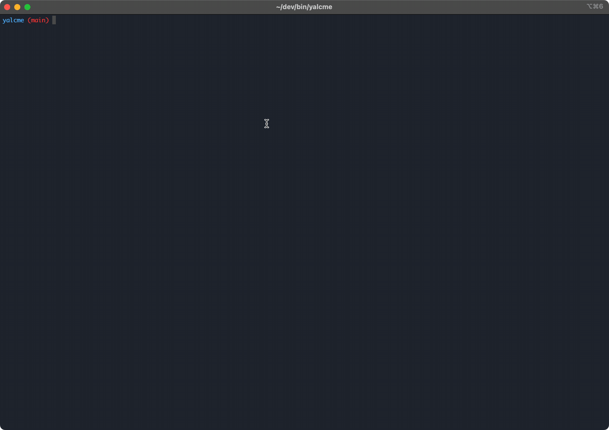

## Yalcme

### Description

Yalc publish and yalc update the easy way.

### Installation

```bash
npm install -g yalcme
```

### Manual Installation
```bash
git clone https://github.com/gkssjovi/yalcme.git
cd yalcme
npm run build
mkdir -p ~/.config/yalcme
cp .env.example .env
cp ./db.json ~/.config/yalcme/db.json
chmod +x ./build/index.js
sudo ln -s "$PWD/build/index.js" /usr/local/bin/yalcme

```

### Usage

```bash
yalcme
```

### Configuration Example

```json
{
  "source": [
    "/Users/user/path/to/source/repo/1",
    {
      "path": "/Users/user/path/to/source/repo/2",
      "beforePublish": "npm run build"
    }
  ],
  "target": [
    "/Users/user/path/to/target/repo/1",
    "/Users/user/path/to/target/repo/2"
  ]
}
```

### Example
